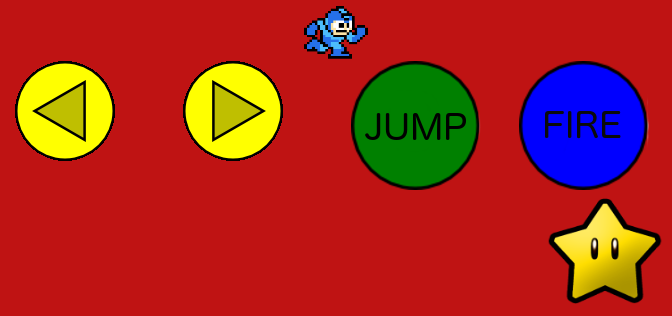

<h1>Not So Super Smash Bros</h1>

<a href="https://not-so-super-smash-bros.herokuapp.com/">Link to Game</a>

<h3>Details: </h3>
  
Not So Super Smash Bros is a multiplayer game that mimics the Nintendo game of Super Smash Brothers. This game is built with socket.io and phaser.io. To play this game, you will need a few things: 

    <ul>
      <li>A second person (up to four)</li>
      <li>A computer</li>
      <li>Each person needs a smart phone</li>
    </ul>
  
You will then go to the link to the game on your computer and then each person will go to the same link on their phone as well. You will then on your computer click the 'HOST GAME' button and enter in the given number on your phone. Once you have more than one player, you can start the game! Each character has 100 HP points, whoever is the last one standing, wins! Remember to have fun!

  
 *** For those of you that are unsure on what Super Smash Brothers is, it is a multiplayer fighting game. You battle against the other people in the game by shooting them with your weapon. The controller that will appear on your phone has 5 buttons, left arrow to move left, right arrow to move right, a jump button, a fire button that allows you to shoot your opponents, and a star button that gives you a power up. The power up will let you shoot in multiple directions.*** 

  <h4>Star Button</h4>
    
Star button on your controller is your power up. Once you see your character change color of the game screen, your power up is activated. Press the star button to use it

  <h3>Download</h3>
  
You must have node and gulp installed in order to download this game

    
To Download this game:

      <ul>
        <li>Fork and clone</li>
        <li>Run npm install</li>
        <li>Run gulp</li>
      </ul>

  <h3>Controllers Layout: </h3>
  

  

  <h3>Individual Controllers: </h3>
  

  

  <h3>Game Character Screen: </h3>
  

  

  <h3>Game Screen: </h3>
  

  
